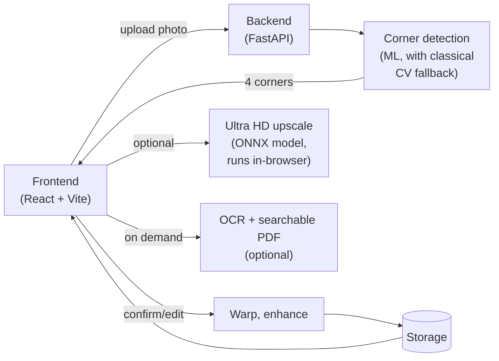

# Document Scanner

Upload a photo of a document and get a cropped, deskewed, enhanced scan back
(color, grayscale, or black & white). Corners are auto-detected; there's a
quick confirm/edit step before processing.

**Live demo:** https://muradshvv.github.io/scandeck/ (frontend on GitHub
Pages, backend on Render's free tier - the first request after inactivity can
take ~30s while it wakes up).

## Architecture



Full detail (every module and endpoint) is in the code and the sections below; this is the high-level shape.

## Requirements

- **Python 3.11+** (backend)
- **Node.js 20+** and npm (frontend)
- Windows (`start.bat` uses `cmd`); on macOS/Linux run the two `Then, from the
  project root` commands below manually instead.

## Running locally

### 1. Backend setup

```powershell
cd backend
python -m venv venv
venv\Scripts\pip install -r requirements.txt
```

Optional extras (install if you want the MobileNetV2 fallback corner
detector, and/or OCR + searchable PDF export):

```powershell
venv\Scripts\pip install -r requirements-ml.txt
venv\Scripts\pip install -r requirements-ocr.txt
```

### 2. Frontend setup

```powershell
cd ..\frontend
npm install
```

### 3. Run both together

From the project root:

```cmd
start.bat
```

This opens two terminal windows: the backend on `127.0.0.1:8001`
(`uvicorn app.main:app`) and the frontend dev server on `localhost:5173`. The
backend also auto-opens `http://127.0.0.1:8001` in your browser on startup
(set `SCANNER_NO_BROWSER=1` to disable).

Or run them individually, each from its own directory:

```powershell
# backend
cd backend
venv\Scripts\activate
uvicorn app.main:app --host 127.0.0.1 --port 8001

# frontend (separate terminal)
cd frontend
npm run dev
```

Then open `http://localhost:5173` in a browser.

### 4. Production build (frontend)

```powershell
cd frontend
npm run build
```

Outputs static assets to `frontend/dist/`. The FastAPI backend is API-only
(see `GET /` below) and is not set up to serve this build directly — it must
be served separately (e.g. `npm run preview`, or any static file host) with
`VITE`-configured requests pointed at the backend's URL.

## How it works

1. `POST /api/upload` - decodes the image, runs the corner-detection chain.
2. User confirms or adjusts the corners in the frontend.
3. `POST /api/process` - warps to a flat rectangle, applies the selected
   style, optionally upscales. Returns the result and a download link.
4. `GET /api/download/{id}` - serves the file (image, standard PDF, or
   searchable PDF).

Uploads and processed files live under `backend/storage/` and expire after an
hour - this is scratch space for the current session, not history storage.
Scan history itself lives entirely in the browser (`frontend/src/lib/historyStore.ts`,
IndexedDB) so it survives backend restarts/redeploys and free-tier host
sleep cycles, which would otherwise wipe anything stored server-side.
Nothing leaves localhost when run locally.

## Ultra HD upscale

Runs entirely client-side, not on the server. `frontend/src/lib/upscale.ts`
loads an RRDBNet ([Real-ESRGAN](https://github.com/xinntao/Real-ESRGAN))
super-resolution model as ONNX (`frontend/public/models/ultra_hd_upscaler.onnx`,
exported from `ml/models/ultra_hd_upscaler.pt`) and runs it in the browser via
`onnxruntime-web`/WASM. The image is processed in small fixed-size overlapping
tiles - each tile stays a constant shape regardless of position, and results
are stitched back together - so memory use depends on tile size, not the
source image's resolution, and nothing is ever downscaled before enhancing.
The AI pass runs on the true original scan resolution, not on any
server-side enlargement - `backend/app/scanner.py`'s classical
`upscale_to_hd` still exists but this toggle no longer triggers it, since
chaining a classical enlarge before the AI pass just made the model refine
already-interpolated pixels instead of real detail.

Off by default; toggled in Settings.

## OCR & searchable PDF

`backend/app/ocr.py` runs EasyOCR on demand via `GET /api/ocr/{id}`, 
returning extracted text and per-word confidence.
`backend/app/pdf_export.py` builds the searchable PDF variant - the scan
image with an invisible text layer positioned from the OCR word boxes.

Both are optional (`requirements-ocr.txt`); without it, those endpoints
return a 503. OCR quality depends heavily on the source photo's resolution -
upscaling a low-res crop first doesn't help, since there's no detail to
recover.

## ML / model weights

`ml/models/` holds every model file the backend loads at runtime. `document_detector_*.pt`
was trained on SmartDoc 2015 via a Kaggle GPU notebook.

## Repo layout

```
CVPROJ/
├── README.md                 You are here ._.
├── start.bat                 Launches backend + frontend together for local dev.
├── render.yaml                Backend deploy
├── .github/workflows/
│   └── deploy-pages.yml           Builds and deploys frontend/ to GitHub.
│
├── backend/                  FastAPI server.
│   ├── requirements.txt          Core deps (FastAPI, OpenCV, etc.) - always needed.
│   ├── requirements-ml.txt       Optional: torch, for the MobileNetV2 fallback corner detector.
│   ├── requirements-ocr.txt       Optional: EasyOCR, for text extraction and searchable PDFs.
│   └── app/
│       ├── main.py                API routes: /api/upload, /api/process, /api/download, /api/ocr, /api/export.
│       ├── model_paths.py         Resolves ml/models/ regardless of where the app is run from.
│       ├── detector.py            Primary corner detector
│       ├── scanner.py             Classical CV corner fallback, perspective warp, color/gray/b&w enhance.
│       ├── corner_model.py        Less accurate trained corner detector (document_detector_2.pt).
│       ├── ocr.py                 EasyOCR text extraction.
│       └── pdf_export.py          Builds searchable PDFs from OCR word boxes.
│
├── frontend/               
│   ├── vercel.json             Vercel build config (see "Deploying" above).
│   └── src/
│       ├── App.tsx                Top-level layout: sidebar, topbar, and page routing.
│       ├── main.tsx               React entry point.
│       ├── types.ts               Shared TypeScript types for API payloads.
│       ├── api/client.ts           Fetch wrappers for all backend endpoints.
│       ├── hooks/
│       │   ├── useScanFlow.ts         Drives the upload → adjust → result flow and its state.
│       │   └── useSettings.ts         Persists theme/default mode/toggles to localStorage.
│       ├── lib/
│       │   ├── historyStore.ts        Scan history, stored in the browser (IndexedDB), not the server.
│       │   ├── imageAdjust.ts         Client-side brightness/contrast/etc. canvas adjustments.
│       │   ├── rotate.ts              Rotation math kept in sync with scanner.py's cv2.rotate geometry.
│       │   └── upscale.ts             Ultra HD upscale - runs the ONNX model in-browser, tile by tile.
│       └── components/
│           ├── BrandMark.tsx          App logo.
│           ├── Stepper.tsx            Upload/Confirm/Done progress indicator.
│           ├── AdjustmentPanel.tsx    Manual brightness/contrast/etc. controls on the result step.
│           ├── BeforeAfterSlider.tsx  Draggable before/after comparison slider.
│           ├── HelpBubble.tsx         Keyboard-shortcut help popover.
│           ├── LoadingOverlay.tsx     Full-screen spinner shown during upload/processing.
│           ├── Toast.tsx / ToastContext.ts   Toast notification system.
│           ├── layout/
│           │   ├── Sidebar.tsx            Page navigation (Scan/History/Settings).
│           │   └── Topbar.tsx             Top bar with theme toggle.
│           ├── pages/
│           │   ├── ScanPage.tsx           Hosts the upload/adjust/result step flow.
│           │   ├── HistoryPage.tsx        Lists and re-downloads past scans.
│           │   └── SettingsPage.tsx       Theme, default style, upscale toggle, clear history.
│           └── steps/
│               ├── UploadStep.tsx         File picker / drag-drop.
│               ├── AdjustStep.tsx         Corner adjustment before processing.
│               └── ResultStep.tsx         Final scan preview, download, before/after compare.
│
└── ml/
    └── models/               
        ├── document_detector_1.pt    Primary corner detector.
        ├── document_detector_2.pt    Secondary corner detector.
        ├── ultra_hd_upscaler.pt      Ultra HD upscale source weights (exported to frontend/public/models/*.onnx).
        ├── text_detector.pt          text detector.
        └── text_reader.pt            text recognizer.
```
